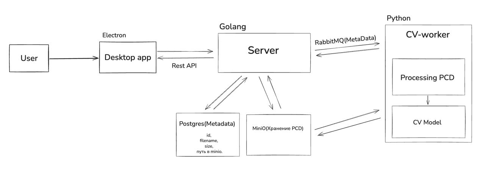

# LidarCleaner




## Запуск (Backend + Frontend)

### 1) Backend (Docker Compose)

В одном терминале запустите backend и инфраструктуру (PostgreSQL, MinIO, RabbitMQ):

```bash
cd backend
docker compose up -d --build
docker compose logs -f app
```

Проверка здоровья:

```bash
curl http://localhost:8000/health
```

### 2) Frontend (Electron + Vite)

Во втором терминале запустите приложение Electron c указанием адреса backend:

```bash
cd frontend
npm i
BACKEND_URL=http://localhost:8000 npm run dev
```

По умолчанию `BACKEND_URL` = `http://localhost:8000`. При необходимости измените на другой адрес.

### 3) Проверка взаимодействия

- В окне приложения нажмите «Open PCD File» и выберите `.pcd` файл — он автоматически отправится на backend через POST `/files/upload_file`.
- Логи backend можно смотреть командой:

```bash
cd backend
docker compose logs -f app
```

Опционально, можно проверить подключение из консоли рендерера:

```javascript
await window.api.backendHealth()
```

## Навигация и горячие клавиши

- Основное
  - R — Reset камеры
  - F — Fit ко всей сцене
  - Alt+F — Fit к точке/кластеру под курсором
  - G — Вкл/выкл сетку
  - X — Вкл/выкл оси
  - H — Домашний вид (0,0,5 → target 0,0,0)
  - O — Автоворот камеры (toggle)

- Фокусировка
  - Double click — Фокус на точку под курсором с мягким перелётом
  - Shift + Double click — Добавочный фокус (смешивание со старым target)
  - Ctrl + Click — Установить target без перелёта

- Presets (сохраняются в localStorage)
  - Alt+1..9 — Загрузить пресет
  - Ctrl+Alt+1..9 — Сохранить пресет

- Fly-режим (огляд/полёт)
  - T — Вкл/выкл fly-mode
  - Управление: WASD — движение, Q/E — вниз/вверх
  - Мышь — поворот (yaw/pitch)
  - Shift — ускорение, Ctrl — медленнее/точнее

- Жесты
  - Alt + колесо — изменять размер точек (экранный)
  - Zoom к курсору — включён (OrbitControls.zoomToCursor)
  - Панорамирование — средняя кнопка; вращение — правая кнопка

- Прочее
  - Автовыравнивание облака по плоскости: тонкая ось → Y-up, затем опускание на y=0
  - Мини-компас в углу; клики дают быстрые виды (Front/Side/Top)
  - Состояние камеры (position/target) сохраняется между сессиями

---

## Редактор лидарных карт: ML-компонент

**Компонент для автоматизации удаления динамики (движущиеся объекты/стоящие авто) из лидарных PCD/Ply-облаков для статических карт.**

### 🛠️ Стек технологий

-   **Языки/ML**: `Python`, `PyTorch (PointNet++)`
-   **Обработка данных**: `PCL`, `Open3D`, `CloudCompare`
-   **ОС/Инструменты**: `Jupyter`, `Colab`, `Kaggle`

### 📊 Датасеты и обработка

#### KITTI-360

-   **Тип**: Динамические объекты.
-   **Обработка**:
    -   Фильтрация шумов.
    -   Нормализация (x, y, z + intensity).
    -   Oversampling + Downsampling majority
    -   Object Isolation
    -   Аугментация (ротации, scaling).
    -   Разметка классов.
-   **Назначение**: Объекты в движении.

#### Toronto-3D

-   **Тип**: Статические элементы (стоящие авто).
-   **Обработка**:
    -   Конвертация PCD.
    -   Фильтрация.
    -   Аугментация (сдвиги, jitter).
    -   Баланс классов.
-   **Назначение**: Для модели на стоящие объекты.

#### Общее

-   **Разделение**: Train/val/test (80/10/10).
-   **Форматы**: Унификация форматов.

### 🚀 ML Pipeline

1.  **Вход**: PCD-файл (e.g., `points.pcd`, `points.ply`).
2.  **Предобработка**: Фильтрация шумов, нормализация.
3.  **Сегментация**:
    -   **Модель 1 (PointNet++ на KITTI-360)**: Loss Focal + Lovász, для объектов в движении.
    -   **Модель 2 (PointNet++ на Toronto-3D)**: Loss Focal + IoU + Dice, для стоящих авто.
4.  **Удаление**: Слияние масок, исключение точек.
5.  **Постобработка**: Заполнение дыр средней высотой (Open3D), вывод `processed_points.pcd`.
6.  **Валидация**:
    -   **Метрики**: Accuracy, mIoU.
    -   **Визуализация**: CloudCompare.

