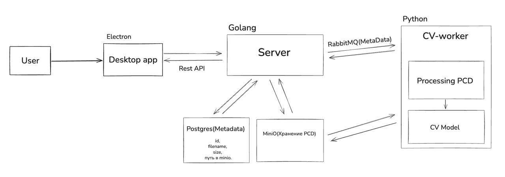
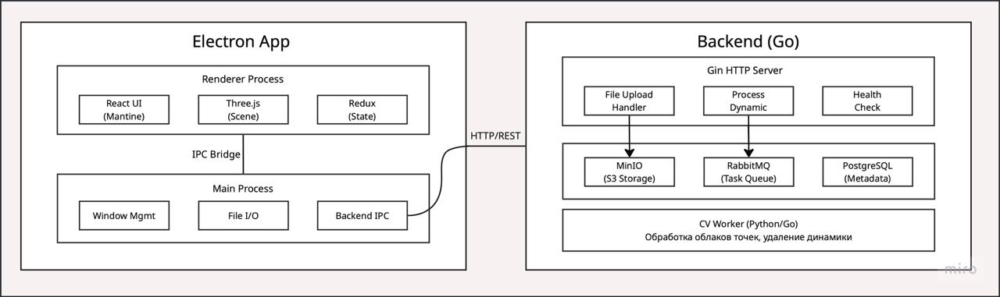

<div align="center">

# 🌟 LidarCleaner

**Профессиональный редактор облаков точек для LiDAR данных**

[](LICENSE)
[](https://www.electronjs.org/)
[](https://reactjs.org/)
[](https://threejs.org/)
[](https://golang.org/)

[Возможности](#-возможности) • [Документация](docs/INDEX.md) • [API](docs/api/rest-api.md) • [ML](ml/README.md)



</div>

---

## 📋 Содержание

- [О проекте](#-о-проекте)
- [Возможности](#-возможности)
- [Требования](#-требования)
- [Быстрый старт](#-быстрый-старт)
- [Горячие клавиши](#-горячие-клавиши)
- [Документация](#-документация)
- [Roadmap](#-roadmap)
- [Contributing](#-contributing)
- [Лицензия](#-лицензия)

---

## 🎯 О проекте

**LidarCleaner** — это мощный desktop-инструмент для работы с облаками точек в форматах **PCD** и **PLY**. Приложение предназначено для:

- 🔍 **Визуализации** больших облаков точек (миллионы точек)
- ✂️ **Редактирования** - удаление, скрытие, изоляция точек
- 🤖 **Автоматической очистки** - удаление динамических объектов с помощью AI
- 💾 **Экспорта** в оптимизированных форматах
- 📊 **Измерений** расстояний между точками
- 🎨 **Кастомизации** цветов и отображения

---

## ✨ Возможности

### 🖼️ Визуализация

- **Поддержка форматов**: PCD (Point Cloud Data), PLY (Polygon File Format)
- **Режимы отображения**: цвета точек, фиксированный цвет
- **Элементы сцены**: оси координат, сетка, ограничивающая рамка
- **Камера**: свободное вращение, панорамирование, масштабирование
- **Виды**: Сверху, Спереди, Сбоку, Сброс камеры

### ✏️ Редактирование

- **Инструменты выделения**:
  - **Box Selection** - прямоугольное выделение (Shift+Ctrl)
  - **Brush Selection** - кисть с настраиваемым размером (B)
  
- **Операции**:
  - Удаление точек (Delete/Backspace)
  - Скрытие/показ точек (H)
  - Изоляция выделения (I)
  - Инвертирование выделения (Ctrl+I)
  - Отмена/Повтор (Ctrl+Z / Ctrl+Shift+Z)

- **Модификаторы**:
  - Ctrl - добавить к выделению
  - Alt - убрать из выделения

### 🤖 AI-обработка

- **Автоудаление динамики** - удаление движущихся объектов (машины, люди)
- **Прогресс обработки** - визуальный индикатор с временем
- **Фоновая обработка** - работа продолжается в фоне

### 📏 Инструменты

- **Сохранение видов** - запоминание позиций камеры (Alt+1..5)
- **Блокировка камеры** - фиксация камеры для точного выделения (Ctrl hold)

### 🎨 Интерфейс

- **Темная/Светлая тема** - переключение цветовой схемы
- **Компактное меню** - все инструменты под рукой
- **Контекстные меню** - быстрый доступ к действиям
- **Уведомления** - информация о процессах
- **Недавние файлы** - быстрый доступ к последним проектам

### 💾 Экспорт

- **PLY** - стандартный формат с цветами
- **PLY (Binary)** - оптимизированный бинарный формат
- **PCD** - Point Cloud Data формат

---

## 📦 Требования

### Backend

- **Docker** >= 20.10
- **Docker Compose** >= 2.0
- **8GB RAM** (рекомендуется 16GB для больших файлов)
- **Свободное место**: ~10GB для образов и данных

### Frontend

- **Node.js** >= 18.0
- **npm** >= 9.0
- **ОС**: Linux (Wayland/X11), Windows, macOS

---

## 🚀 Быстрый старт

### Вариант 1: Единый скрипт запуска (рекомендуется)

```bash
# Клонируйте репозиторий
git clone https://github.com/qquerellka/LidarCleaner.git
cd LidarCleaner

# Запустите приложение
./start-lidarcleaner.sh
```

При первом запуске:
1. Скрипт проверит наличие Docker
2. Запустит backend-сервисы (PostgreSQL, MinIO, RabbitMQ, Go)
3. Установит frontend-зависимости
4. Предложит выбрать режим:
   - **1 - Development** (с hot-reload и DevTools)
   - **2 - Production** (оптимизированная сборка)

### Вариант 2: Ручной запуск

#### Backend

```bash
cd backend
docker-compose up --build

# Проверка здоровья
curl http://localhost:8000/health
```

#### Frontend (В новой консоли)

```bash
cd frontend
npm install
npm run dev
```

---

## 📚 Документация

### 📖 Основные документы

- **[Быстрый старт](QUICK_START.md)** - установка и первый запуск
- **[Индекс документации](docs/INDEX.md)** - полный список документов
- **[FAQ](docs/user-guide/faq.md)** - часто задаваемые вопросы
- **[Troubleshooting](docs/user-guide/troubleshooting.md)** - решение проблем

### 👨‍💻 Для разработчиков

- **[Contributing](docs/development/contributing.md)** - как внести вклад
- **[Development Guide](docs/development/development.md)** - настройка окружения
- **[Architecture](docs/development/architecture.md)** - архитектура приложения
- **[REST API](docs/api/rest-api.md)** - документация API

### 🤖 Machine Learning

- **[ML Guide](ml/README.md)** - обучение моделей и инференс
- **[Notebooks](ml/notebooks/)** - Jupyter notebooks для обучения

---

## 🏗️ Краткая архитектура

**Подробнее:** [docs/development/architecture.md](docs/development/architecture.md)

### Технологический стек

#### Frontend
- **Electron 30** - Desktop framework
- **React 18** - UI библиотека
- **Redux Toolkit** - State management
- **Three.js** - 3D рендеринг
- **Mantine UI** - Component library
- **TypeScript** - Type safety
- **Vite** - Build tool

#### Backend
- **Go 1.23** - Основной язык
- **Gin** - HTTP framework
- **PostgreSQL 15** - База данных
- **MinIO** - S3-совместимое хранилище
- **RabbitMQ** - Очередь задач
- **Docker** - Контейнеризация

---

## ⌨️ Горячие клавиши

### Навигация
| Клавиша | Действие |
|---------|----------|
| `Колесо мыши` | Масштабирование |
| `ЛКМ + движение` | Вращение камеры |
| `ПКМ + движение` | Панорамирование |
| `Alt + 1..5` | Сохранить вид |
| `1..5` | Загрузить вид |
| `Ctrl + Hold` | Заблокировать камеру |

### Выделение
| Клавиша | Действие |
|---------|----------|
| `B` | Прямоугольное выделение (Box) |
| `V` | Кисть (Brush) |
| `+ / -` | Уменьшить/Увеличить кисть |
| `Ctrl + ЛКМ` | Добавить к выделению |
| `Alt + ЛКМ` | Убрать из выделения |
| `Ctrl + A` | Выделить все |
| `Ctrl + I` | Инвертировать выделение |
| `Escape` | Снять выделение |

### Редактирование
| Клавиша | Действие |
|---------|----------|
| `Delete` / `Backspace` | Удалить выделенное |
| `H` | Скрыть выделенное |
| `Alt + H` | Показать все |
| `I` | Изолировать (скрыть невыделенное) |
| `Ctrl + Z` | Отменить |
| `Ctrl + Shift + Z` | Повторить |

### Инструменты
| Клавиша | Действие |
|---------|----------|
| `?` | Показать помощь |


---

## 🔧 Технологии

### Frontend Technologies

| Технология | Версия | Назначение |
|-----------|--------|-----------|
| [Electron](https://www.electronjs.org/) | 30.0 | Desktop framework |
| [React](https://reactjs.org/) | 18.3 | UI library |
| [TypeScript](https://www.typescriptlang.org/) | 5.5 | Type safety |
| [Redux Toolkit](https://redux-toolkit.js.org/) | 2.9 | State management |
| [Three.js](https://threejs.org/) | 0.180 | 3D rendering |
| [Mantine](https://mantine.dev/) | 7.15 | UI components |
| [Vite](https://vitejs.dev/) | 5.4 | Build tool |
| [esbuild](https://esbuild.github.io/) | 0.25 | JS bundler |

### Backend Technologies

| Технология | Версия | Назначение |
|-----------|--------|-----------|
| [Go](https://golang.org/) | 1.23 | Backend language |
| [Gin](https://gin-gonic.com/) | Latest | HTTP framework |
| [PostgreSQL](https://www.postgresql.org/) | 15 | Database |
| [MinIO](https://min.io/) | Latest | Object storage |
| [RabbitMQ](https://www.rabbitmq.com/) | 3 | Message queue |
| [Docker](https://www.docker.com/) | 20+ | Containerization |

---

## 🐛 Устранение неполадок

**Полный гайд:** [docs/user-guide/troubleshooting.md](docs/user-guide/troubleshooting.md)

**Частые проблемы:**

- Backend не запускается → перезапустите Docker
- Frontend не подключается → проверьте health endpoint
- Electron не открывается → перезапустите процессы
- Файлы не загружаются → проверьте формат и размер
- Медленная отрисовка → уменьшите размер точек

**FAQ:** [docs/user-guide/faq.md](docs/user-guide/faq.md)

---

## 🗺️ Roadmap

### v0.2.0 (В разработке)
- [ ] Поддержка LAS/LAZ форматов
- [ ] Классификация точек (земля, растительность, здания)
- [ ] Экспорт в GeoJSON
- [ ] Облачные вычисления

### v0.3.0 (Планируется)
- [ ] Мультифайловая работа
- [ ] Слияние облаков точек
- [ ] Автоматическое выравнивание
- [ ] Плагинная система

### v1.0.0 (Цель)
- [ ] Стабильный API
- [ ] Полная документация
- [ ] Производственная готовность
- [ ] Локализация (EN, RU, CN)

---

## 🤝 Contributing

Мы приветствуем вклад от сообщества! 

**Полное руководство:** [docs/development/contributing.md](docs/development/contributing.md)

**Быстрый старт:**
1. Fork репозиторий
2. Создайте feature branch
3. Сделайте изменения
4. Добавьте тесты
5. Отправьте Pull Request

**Для разработчиков:** [docs/development/development.md](docs/development/development.md)

---

## 📄 Лицензия

Этот проект распространяется под лицензией **MIT**. Подробности в файле [LICENSE](LICENSE).

---

## 👥 Авторы

- **LidarCleaner Team** - [GitHub](https://github.com/lidarcleaner)

---

## 🙏 Благодарности

- [Three.js](https://threejs.org/) за отличную 3D библиотеку
- [Electron](https://www.electronjs.org/) за desktop framework
- [Mantine](https://mantine.dev/) за красивые UI компоненты
- Всем contributors и тестировщикам

---

## 📞 Контакты и поддержка

- 🐛 **Issues**: [GitHub Issues](https://github.com/qquerellka/LidarCleaner/issues)
- 💬 **Discussions**: [GitHub Discussions](https://github.com/qquerellka/LidarCleaner/discussions)
- 📚 **Документация**: [docs/INDEX.md](docs/INDEX.md)
- ❓ **FAQ**: [docs/user-guide/faq.md](docs/user-guide/faq.md)

---

[⬆ Наверх](#-lidarcleaner)
</div>
