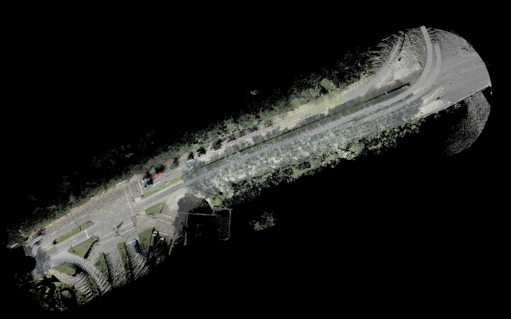
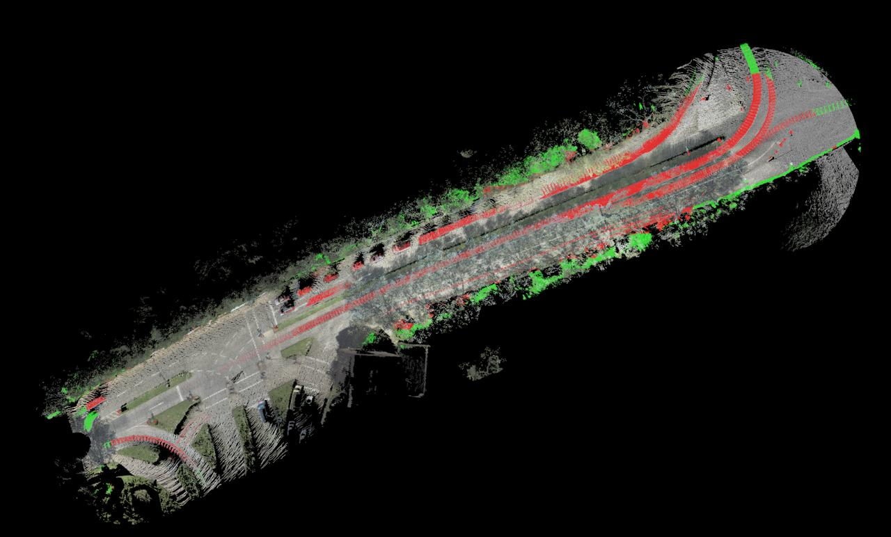
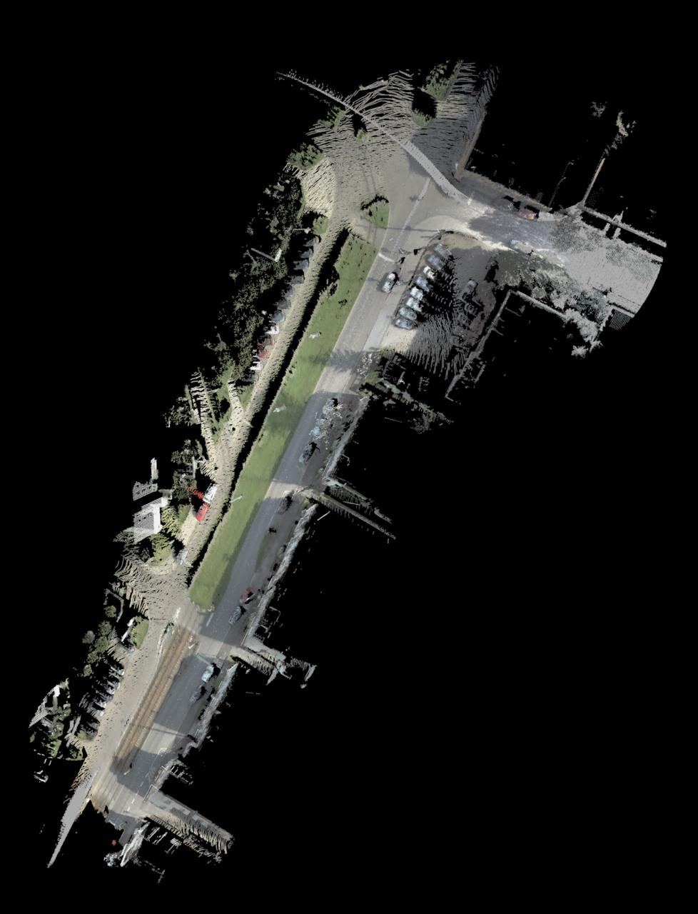
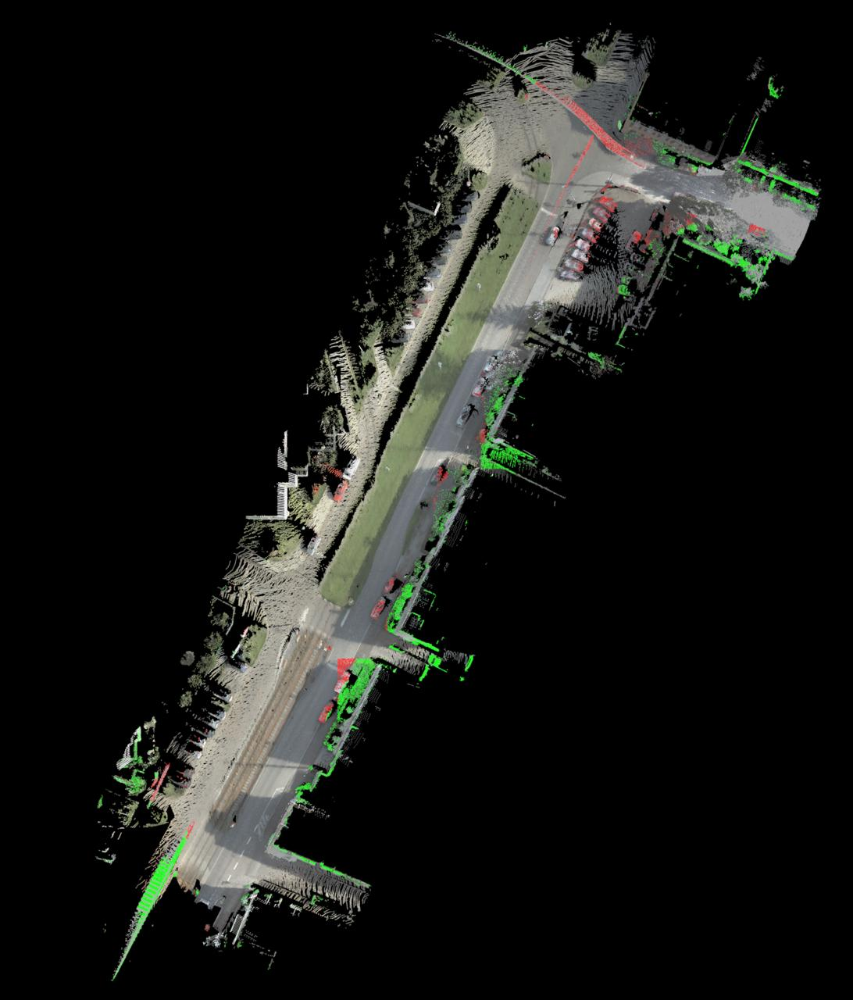

# 🤖 LidarCleaner - Machine Learning

### 🛠️ Стек технологий

-   **Языки/ML**: `Python`, `PyTorch (PointNet++)`
-   **Обработка данных**: `PCL`, `Open3D`, `CloudCompare`
-   **ОС/Инструменты**: `Jupyter`, `Colab`, `Kaggle`
  
Документация по machine learning компонентам LidarCleaner для автоматической очистки облаков точек от динамических объектов.

[📥 Посмотреть итоговые файлы и видео на гугл диске](https://drive.google.com/drive/folders/1abSbwNjoH2PJCoDO8GT03x_V9Ol97dJK?usp=sharing)

---

## 📋 Содержание

- [Обзор](#-обзор)
- [Архитектура](#-архитектура)
- [Модели](#-модели)
- [Датасет](#-датасет)
- [Обучение](#-обучение)
- [Инференс](#-инференс)
- [Результаты](#-результаты)
- [Использование](#-использование)

---

## 🎯 Обзор

ML компонент LidarCleaner использует deep learning для автоматического удаления динамических объектов (автомобили, люди, временные объекты) из облаков точек LiDAR.

### Что делает Auto Clean?

**Удаляет:**
- 🚗 Автомобили
- 🚶 Людей
- Объекты снятые в движении

**Оставляет:**
- 🏢 Здания
- 🛣️ Дороги и тротуары
- 🌳 Деревья
- 🚏 Столбы, знаки, светофоры
- 🪨 Ландшафт, земля

---

## 🏗️ Архитектура

### Используемые модели

#### PointNet++ (основная)
- **Задача**: Семантическая сегментация облаков точек
- **Архитектура**: PointNet++ 
- **Входные данные**: XYZ координаты + RGB цвета + нормали
- **Выход**: Вероятность для каждой точки (динамический/статический)

### Pipeline обработки

```
Input Point Cloud (.pcd/.ply)
        ↓
   Preprocessing
   - Downsampling
   - Normal estimation
   - Color normalization
   - Geometry features calculations
        ↓
   PointNet++ Model
   - Feature extraction
   - Semantic segmentation
        ↓
   Post-processing
   - Threshold filtering (0.4)
   - Hole filling
        ↓
   Output Point Cloud (cleaned)
```

---

## 🧠 Модели
### 1. best_model.pth

**Местоположение:** `ml/models/` или `backend/cv_worker/`

**Описание:**
- Модель PointNet++ для детекции объектов в движении
- Архитектура: PointNet++ 
- Входные features: 9 каналов (XYZ + RGB + Normals)
- Выходные классы: 2 (static/dynamic)

### 2. seg_model_19.pth

**Описание:**
- Модель для детекции автомобилей
- Архитектура: PointNet++ 
- Входные features: 9 каналов (XYZ + RGB + Normals)
- Выходные классы: 4 (car/road/builds/other)
---

## 📊 Датасеты
- [KITTI-360-dataset](https://www.kaggle.com/datasets/greatgamedota/kitti360-3d-semantics)
  -   **Тип**: Динамические объекты.
  -   **Обработка**:
      -   Нормализация (x, y, z + intensity).
      -   Oversampling + Downsampling majority
      -   Object Isolation
      -   Аугментация (ротации, scaling).
- [Toronto-3D](https://www.kaggle.com/datasets/priteshraj10/point-cloud-lidar-toronto-3d)
  -   **Тип**: Статические элементы (стоящие авто).
  -   **Обработка**:
      -   Конвертация PCD.
      -   Фильтрация.
      -   Аугментация (сдвиги, jitter).
      -   Баланс классов.
  -   **Назначение**: Для модели на стоящие объекты.


## 🏋️ Обучение

### Требования

```bash
# Python packages
pip install torch torchvision
pip install open3d
pip install numpy scipy tqdm
pip install matplotlib pandas

# GPU (рекомендуется)
CUDA >= 11.0
GPU Memory >= 8GB
```

### Шаги обучения

#### 1. Подготовка датасета

Используйте `ml/notebooks/preprocessed_dataset.ipynb`:
- Загрузите облака точек
- Выполните препроцессинг
- Разделите на train/val

#### 2. Обучение модели

Используйте `ml/notebooks/train.ipynb`

- **Вход**: PCD-файл (e.g., `points.pcd`, `points.ply`).
-  **Предобработка**: Фильтрация шумов, нормализация.
-  **Сегментация**:
    -   **Модель 1 (PointNet++ на KITTI-360)**: 0.6 * Loss Focal + 0.4 * Lovász, для объектов в движении.
    -   **Модель 2 (PointNet++ на Toronto-3D)**: Loss Focal + IoU + Dice, для стоящих авто.
-  **Удаление**: Слияние масок, исключение точек.

### Гиперпараметры

| Параметр | Значение | Описание |
|----------|----------|----------|
| `batch_size` | 16 | Размер батча |
| `learning_rate` | 0.001 | Начальная скорость обучения |
| `epochs` | 60 | Количество эпох |
| `num_points` | 16384 | Количество точек в сэмпле |
| `voxel_size` | 0.01 |Downsampling|
| `scheduler` | ReduceLROnPlateau | LR scheduler |

---

## 🔮 Инференс
Используйте `ml/notebooks/inference.ipynb`


## 📈 Результаты

#### Пример 1: Городская улица

**До обработки:**

- Облако точек с автомобилями и объектами в движении
- 3.2M точек

**После обработки:**

- Удалены динамические объекты
- Остались только здания и дорога
- 2.1M точек (экономия 35%)

---

#### Пример 2: Парковка

**До обработки:**

- Облако точек с автомобилями и объектами в движении
- 3.5M точек

**После обработки:**

- Удалены автомобили и объекты в движении
- 2.9M точек 

###

| Метрика | Значение |
|---------|----------|
| **mIoU** | 56% |
| **Precision (dynamic)** | 70.1% |
| **Recall (dynamic)** | 60.4% |
| **F1-score** | 65.7% |

### Limitations

❌ **Не работает хорошо в случаях:**
- Очень плотные сцены (> 10M точек)
- Облака точек без цветов
- Экстремальные условия (дождь, снег)
- Необычные объекты (не в training set)

✅ **Работает хорошо для:**
- Городских сцен (улицы, парковки)
- Облаков точек с RGB цветами
- Типичных объектов (машины, люди)
- Средних по размеру сцен (< 5M точек)

---

## 🚀 Использование

### В приложении LidarCleaner

1. Откройте облако точек в приложении
2. Нажмите кнопку **"Auto Clean"**
3. Дождитесь обработки (~5-15 минут)
4. Результат загрузится автоматически

## 📚 Дополнительные материалы

### Jupyter Notebooks

| Notebook | Описание |
|----------|----------|
| `notebooks/train.ipynb` | Обучение модели PointNet++ |
| `notebooks/inference.ipynb` | Инференс на новых данных |
| `notebooks/preprocessed_dataset.ipynb` | Препроцессинг датасета |
| `notebooks/train_inference_analytics.ipynb`| Полный pipline для классификации машин |

### Модели

| Файл | Размер | Описание |
|------|--------|----------|
| `models/best_model.pth` | ~4 MB |Модель PointNet++ для детекции объектов в движении|
| `models/seg_model10.pth` | ~4 MB | Модель PointNet++ для детекции автомобилей |

### Изображения

| Файл | Описание |
|------|----------|
| `images/smp1.jpeg` | Пример "до" (улица) |
| `images/after_model_smp1.jpeg` | Пример "после" (улица) |
| `images/smp2.jpeg` | Пример "до" (парковка) |
| `images/after_model_smp2.jpeg` | Пример "после" (парковка) |

---

## 🤝 Contributing

Хотите улучшить ML модель?

1. Обучите на новом датасете
2. Попробуйте другие архитектуры (PointNet++MSG, DGCNN)
3. Добавьте аугментации
4. Оптимизируйте гиперпараметры

См. [../docs/development/contributing.md](../docs/development/contributing.md)

---

## 📖 References

### Papers

- **PointNet++**: [Link](https://arxiv.org/abs/1706.02413)
  - Qi et al., "PointNet++: Deep Hierarchical Feature Learning on Point Sets in a Metric Space", NeurIPS 2017

- **PointNet**: [Link](https://arxiv.org/abs/1612.00593)
  - Qi et al., "PointNet: Deep Learning on Point Sets for 3D Classification and Segmentation", CVPR 2017

### Code

- **Official PointNet++ PyTorch**: [GitHub](https://github.com/yanx27/Pointnet_Pointnet2_pytorch)
- Используется в `backend/cv_worker/Pointnet_Pointnet2_pytorch/`

---

## 🐛 Troubleshooting

### CUDA out of memory

**Решение:**
- Уменьшите `BATCH_SIZE`
- Уменьшите `NUM_POINTS` (4096 → 2048)
- Используйте gradient checkpointing

### Model не загружается

**Решение:**
```python
# Попробуйте map_location
model.load_state_dict(torch.load('best_model.pth', map_location='cpu'))
```
---

## 📧 Контакты

Вопросы по ML части:
- 🐛 [GitHub Issues](https://github.com/qquerellka/LidarCleaner/issues)
- 💬 [Discussions](https://github.com/qquerellka/LidarCleaner/discussions)

---

<div align="center">

[⬆ Наверх](#-lidarcleaner---machine-learning) | [🏠 README](../README.md) | [📚 Docs](../docs/INDEX.md)

</div>
